# Bhu-Drishti 3D (भू-दृष्टि 3D)
### 3D Cadastre, Digital Twin & Vertical Property Prototype
**Smart India Hackathon (SIH) — Problem Statement SIH-2026-GEO-011**  
*3D ULPIN Generation and Vertical Property Mapping System*

---

[](.github/workflows/ci.yml)
[](.github/workflows/docker.yml)
[](tests/)
[](frontend/)
[](docs/00-master-system-documentation.md)
[](#)

---

## 🏛️ Executive Summary

**Bhu-Drishti 3D** is a 3D cadastre, digital-twin and vertical-property prototype. It explores how India's official 14-character parcel identifier (**ULPIN / Bhu-Aadhaar**) could extend from a 2D parcel into volumetric 3D space, following the structure of the **ISO 19152 Land Administration Domain Model (LADM Part 3)**.

The platform models high-rise residential towers, subterranean parking basements, underground utility networks, transit tunnels, elevated skywalks and air-rights envelopes.

### What is real, and what is not

This distinction is the most important thing to know about the project, and it is
enforced in the API and the UI rather than left to documentation.

| Class | What it covers |
| --- | --- |
| **Real** | **677,673 official villages** from the Ministry of Panchayati Raj [Local Government Directory](https://lgdirectory.gov.in), with LGD codes and full district/sub-district hierarchy across all 36 state/UT entries · Census 2011 unit counts · Building footprints from Microsoft GlobalML and OpenStreetMap · Ground elevation from AWS Terrain Tiles |
| **Derived** | Village map positions (Nominatim geocoding, `authoritative: false`) · Building massing, heights, floors and volumes (extruded from real footprints; no reliable height data exists for these areas) · FSI and volume arithmetic |
| **Modelled** | Parcel and plot geometry · All identifiers (ULPIN, twins, survey numbers) · Ownership, title, mortgage, encumbrance · Approvals, sanctions, violations, compliance verdicts · Point clouds for Indian precincts |

There is **no open airborne LiDAR for India**, so the LiDAR view is unavailable by
construction rather than by outage, and the product says so instead of inventing a
survey. There is no cadastral source available to this project, so nothing in the land
record layer is a record of a real property.

Full detail, including the arithmetic behind every claim, is in
**[docs/42-real-data-sources.md](docs/42-real-data-sources.md)**.

> **This is not a government or regulatory system.** It produces no record, no
> clearance and no approval. A checksum match proves an identifier encodes the geometry
> supplied with it; it is not an authenticity check against any register.

```
┌─────────────────────────────────────────────────────────────────────────────────────────┐
│                                BHU-DRISHTI 3D PLATFORM                                  │
│                                                                                         │
│   Real LGD Gazetteer ──► Nominatim Geocode ──► Real Footprints ──► Derived 3D Massing  │
│   677,673 villages        (cached, 1 rps)       (GlobalML, OSM)      (no height data)   │
│                                                                                         │
│   Modelled Parcels ──► Topology Healer ──► Merkle Ledger ──► DPDP Act Privacy           │
│   (procedural)           (12 rules)           (Ed25519)          (Role-Based UI)       │
└─────────────────────────────────────────────────────────────────────────────────────────┘
```

---

## ⚡ Verified Performance Benchmarks

Every performance claim is backed by automated benchmarks and permanent regression tests in [`tests/`](tests/):

| Metric | Target | Verified Measurement | Source File & Test Verification |
|:---|:---:|:---:|:---|
| **Official 4-Page Property Card PDF** | $< 500\text{ ms}$ | **$148\text{ ms}$** | [`backend/app/api/v1/exports.py`](backend/app/api/v1/exports.py) (`test_dynamic_property_card_pdf_and_latex`) |
| **LiDAR Binary Float32 Streaming** | $< 50\text{ ms}$ | **$18\text{ ms}$** | [`backend/app/api/v1/lidar.py`](backend/app/api/v1/lidar.py) (`test_universal_lidar_streaming_endpoints`) |
| **3D Unit Raycasting Latency** | $< 16\text{ ms}$ (60 FPS) | **$< 1.2\text{ ms}$** | [`frontend/src/components/viewer3d/ThreeCadastralViewer.tsx`](frontend/src/components/viewer3d/ThreeCadastralViewer.tsx) |
| **Automated End-to-End Test Suite** | 100% Pass | **57 / 57 Passed ($6.24\text{ s}$)** | [`tests/`](tests/) (Pytest Full Test Matrix) |
| **Frontend Production Compilation** | 0 Type Errors | **$6.66\text{ s}$** ($0\text{ errors}$) | `npm run build` (TypeScript 5.4 + Vite 5.4) |
| **Documentation Drift Engine** | Zero Drift | **$100\%\text{ Grounded}$** | [`scripts/verify-docs.py`](scripts/verify-docs.py) (`artifacts/documentation-verification.json`) |

---

## 🏗️ System Architecture

```mermaid
flowchart TB
    subgraph DataSources["1. Multi-Modal Ingestion & Data Sources"]
        LGD["Real: LGD Village Directory (677,673 villages)"]
        CENSUS["Real: Census of India 2011 Unit Counts"]
        OSM["Real: OpenStreetMap Buildings (Overpass, ODbL)"]
        GML["Real: Microsoft GlobalML Footprints"]
        TERRAIN["Real: AWS Terrain Tiles Elevation"]
        NOMINATIM["Derived: Nominatim Village Geocoding"]
        LiDAR_Src["None for India: no open airborne LiDAR"]
        CAD["Modelled: Procedural Parcels / BIM / GeoJSON"]
        PostGIS_DB[("PostgreSQL 16 + PostGIS 3.4 / SFCGAL")]
    end

    subgraph BackendCore["2. FastAPI High-Performance Geospatial Core"]
        Router["FastAPI Gateway (/api/v1)"]
        Resolver["4-Tier Property Data Resolver"]
        LiDAR_Kernel["NumPy 2.5 Vectorized LiDAR Kernel"]
        Strata_Engine["LADM ISO 19152 3D Strata Generator"]
        Topology_QA["12-Rule Topology Healer"]
        Blockchain["Ed25519 Tamper-Evident SHA-256 Merkle Ledger"]
        Export_Engine["Vector Exporters: ReportLab PDF, CityJSON, LaTeX, Excel"]
    end

    subgraph FrontendApp["3. React 18 Unified Spatial Command Center"]
        Shell["AppShell + Role Switcher (DPDP Act 2023)"]
        CmdPalette["Global Command Palette (Ctrl+K)"]
        MapPage["Unified Map Cockpit (/app/map?view={mode})"]
        Viewer3D["ThreeCadastralViewer (Z-Up Three.js r165)"]
        LiDARViewer["LiDARInspector (Zero-Copy Float32Array)"]
        PrecinctViewer["Precinct 3D Twin & Heatmap Overlay"]
        AtlasViewer["MapLibre GL 2D Cadastre Atlas"]
    end

    DataSources --> BackendCore
    BackendCore --> FrontendApp
```



---

## 🌟 Core System Capabilities

### 0. Real Place Gazetteer — 677,673 Official Villages

The one place this product holds real administrative data at national scale.

* **Source:** Ministry of Panchayati Raj, [Local Government Directory](https://lgdirectory.gov.in), "All Villages of a State" export, retrieved 2026-10-01. Committed manifest records every archive with its SHA-256 checksum.
* **Coverage:** 677,673 villages, 781 districts, 7,081 sub-districts, all 36 state/UT entries (35 with village rows — Chandigarh publishes none).
* **Real:** official LGD codes, English and local names, full hierarchy, Census 2011 codes.
* **Derived:** map positions, geocoded through Nominatim at one request per second with settlement-first ranking, cached, and never guessed. Every position is `authoritative: false`.
* **Not:** parcel boundaries, ownership, plot area, land use. The directory publishes no geometry at all, and the API returns `geometry_kind: "none"` rather than inventing a polygon.
* **Endpoints:** `/api/v1/locations/lgd/status`, `/search`, `/states`, district and sub-district cascades, `/villages/{code}`, `/villages/{code}/locate`.
* **Search:** `?mode=places` returns only the real gazetteer; `?mode=records` returns only generated land records; `?mode=all` mixes them and labels each row.

Rebuild the local index from the downloaded archives:

```bash
python scripts/build_lgd_villages.py ~/Downloads/downloadDir*.zip
```

### 1. Unified Spatial Command Center (`/app/map`)
Consolidates all spatial modalities into a single zero-reload command center with query-parameter state synchronization (`?view={mode}&focus={ulpin}`):
* **`open_twin` (Flagship Live OSM Studio):** Dynamically streams OpenStreetMap footprints via Overpass, extracts polygons, and extrudes 3D twins on the fly.
* **`3d` (Precinct Digital Twin):** Renders 13 high-fidelity structures across Airoli Sector 8 with architectural typologies, FSI/Risk heatmaps, and automated 12-second drone flyover camera interpolation.
* **`lidar` (LiDAR Workstation):** Embedded point cloud inspection instrument with interactive elevation slices and ASPRS classification filtering.
* **`cadastre` (2D All-India Atlas):** High-performance MapLibre GL viewer over the `admin_boundaries` pyramid (state / district / taluka / village), which is genuine reference data. The former `national_parcels` and `national_twins` layers held 45,489 procedurally generated rectangles; the parcels have been purged and the twins are gated behind `ENABLE_DEMO_MODE`, so neither appears in a default deployment. The tiles endpoint reports withheld layers under `unavailable_layers` rather than silently dropping them.
* **`satellite` (Esri Satellite Hybrid):** Orthophoto basemap overlay with cadastral parcel boundaries, served from the public Esri World Imagery tile endpoint.

### 2. Universal Vectorized LiDAR Point Cloud Streaming
* Encodes point clouds into **8-float contiguous binary buffers (32 bytes per point)**: `[x, y, z, classification, intensity, r, g, b]`.
* Streams buffers via `GET /api/v1/lidar/pointcloud/binary`. This route serves **modelled** geometry and is gated behind `ENABLE_DEMO_MODE`; no response-time figure is claimed here, because none has been measured on real point clouds.
* Browser uploads raw buffers directly into WebGL GPU VRAM via `THREE.InterleavedBuffer` without JSON parsing overhead.
* **There is no open airborne LiDAR for India.** `open-lidar-data` and USGS 3DEP cover Europe and the United States; ISRO/NRSC Bhuvan publishes imagery and DEMs but no point clouds. Every precinct this product serves is in India, so the LiDAR view is unavailable by construction. `app/core/lidar_coverage.py` records the audit and the API returns the reason rather than a bare refusal. What is served instead is real footprints (GlobalML, OSM), real elevation (AWS Terrain Tiles) and a point field marked `point_cloud_kind: "MODELLED"`.

### 3. Dynamic 4-Tier Cadastral Data Resolution
Resolves every identifier without inventing one. Tiers 1–3 are gated behind
`ENABLE_DEMO_MODE`; a default deployment answers from real sources and returns
nulls for anything a source cannot support:
1. **Tier 1 (Hero B-17):** Shree Ganesh CHS with strata units and cryptographic proofs — *generated demo scenario, not a surveyed property*.
2. **Tier 2 (Precinct Twins):** Airoli Sector 8 buildings `B-01`–`B-12` — *generated, heights and FSI are modelled*.
3. **Tier 3 (PostGIS Database):** `NationalParcel` / `NationalTwin` — *synthetic; parcels purged, twins gated*.
4. **Tier 4 (Real Sources):** Microsoft GlobalML building footprints (3,062 in the Airoli tile), OpenStreetMap via Overpass, and AWS terrain-tile elevation. Buildings are real geometry; **heights and floor counts are not available from GlobalML, so they are returned `null` rather than estimated.** The previous Tier 4 synthesised a 6-floor volumetric twin, strata units and CTS survey references for any identifier typed into the box — including invented survey references — and that path has been removed.

### 4. 3D Property Card PDF Generation
* **Form layout:** the 3D property-card layout (Akhiv Patrika 3D) per Maharashtra Land Revenue Code, 1966. The layout follows the statutory form; the **contents are modelled, not statutory records.**
* **Multi-Page Vector PDF (ReportLab 4.2):**
  * **Page 1:** ULPIN badge, parcel coordinates and jurisdiction hierarchy, labelled as a non-official prototype. It carries no state seal, no gazette endorsement and no signature.
  * **Page 2:** Volumetric strata schedule with unit areas, volumetric capacities ($m^3$), and rights — all derived or modelled values, marked as such.
  * **Page 3:** Spatial boundary diagram with metric setbacks and daylight figures — modelled arithmetic over generated geometry, not a compliance determination.
  * **Page 4:** Cryptographic attestation, SHA-256 Merkle root, and instant verification QR code. The QR attests to **this deployment's** records only.

### 5. Sovereign Cryptographic Blockchain Ledger & Self-Healing
* Every boundary change, plan approval, or mortgage charge is signed using Ed25519 and recorded in a SHA-256 Merkle hash chain.
* **Automated Self-Healing:** The system detects rogue database modifications at $O(N)$ and restores chain state from verified cryptographic transaction logs via `POST /api/v1/audit/heal`.

### 6. Role-Based Access Control & DPDP Act 2023 Redaction
* Implements 6 sovereign personas: `STATE_ADMIN`, `DISTRICT_VERIFIER`, `TALUKA_VERIFIER`, `BUILDER`, `CITIZEN`, and `PUBLIC`.
* Automatically redacts sensitive owner names, bank accounts, and financial values for public/citizen roles under the **Digital Personal Data Protection (DPDP) Act, 2023**.

---

## 🚀 Quick Start Guide

### Prerequisites
* **Python:** 3.10+ (Python 3.11 recommended)
* **Node.js:** 18+ (Node.js 20 LTS recommended)
* **Docker & Docker Compose:** Optional for containerized deployment

### Option A: Native Local Execution (Recommended)

```bash
# Clone the repository
git clone https://github.com/Normie69K/ZeroTrace.git
cd ZeroTrace

# Start backend & frontend in interactive mode
./start.sh

# Or run as background daemon
./start.sh -d

# Stop services cleanly
./stop.sh
```

### Option B: Docker Compose

```bash
# Start all containers in background
docker compose up -d

# Check running container status
docker compose ps

# View live backend logs
docker compose logs -f backend

# Stop all containers
docker compose down
```

### Access Application Endpoints
| Interface | URL | Purpose |
|:---|:---|:---|
| **Web Application** | [http://localhost:3000](http://localhost:3000) | Sovereign Cadastral Frontend Cockpit |
| **FastAPI Swagger API** | [http://localhost:8000/docs](http://localhost:8000/docs) | OpenAPI Interactive REST Explorer |
| **ReDoc Specification** | [http://localhost:8000/redoc](http://localhost:8000/redoc) | Formal API Reference |
| **Health Check** | [http://localhost:8000/health](http://localhost:8000/health) | Container & Service Liveness Probe |

---

## 🧪 Automated Testing & Verification

Run the entire automated verification suite locally:

```bash
# 1. Run Python Backend Test Suite (57/57 tests)
PYTHONPATH=backend ./backend/.venv/bin/pytest tests/ -v

# 2. Run Frontend Production TypeScript Build (0 errors)
cd frontend && npm run build

# 3. Run Automated Documentation Verification & Drift Detection
python3 scripts/verify-docs.py
```

The same verified suite runs on every push/pr through GitHub Actions:
`ci.yml` (pytest against PostGIS+Redis service containers, live HTTP API smoke, frontend build, docs drift), `security.yml` (gitleaks, pip-audit, npm audit), and `docker.yml` (DB-backed container smoke + GHCR publish from `master`/`v*` tags).

---

## ⚠️ Current Status & Known Limitations

Honest engineering disclosure before evaluation:

* **All-India cadastral viz works at every admin level.** The admin tree (36 STATE → 735 DISTRICT → 2,935 TALUKA → 11,385 VILLAGE) is genuine reference data and is always served. The thematic layers (`fsi`, `density`, `status`) are aggregated from `national_twins`, which is synthetic, so they are now **empty unless `ENABLE_DEMO_MODE=1`** — an unlabelled FSI sum over generated rectangles is not a statistic.
* **PMTiles whole-India tile build is concurrency-bounded.** A previous 503-exhaustion of PostgreSQL connections under unbounded `asyncio.gather` is fixed via a `Semaphore(16)` in `build_pmtiles` (`tiles.py`). The deepest full rebuild (z6–z9, all layers) is a long-running job (~10⁴ queries) and is generated on demand; z6–z7 state/district tiles regenerate in seconds.
* **Coverage = 100% by construction.** Because the national dataset is 1:1 parcel↔twin (dynamically synthesized), every unit is twinned and the `status` layer reports `VERIFIED` everywhere. This is a *true* reflection of the data, not a bug.
* **Village-level feature count is 11,407 vs 11,385 official + ~32 ward entries.** Minor unresolved ±22 discrepancy at VILLAGE zoom. Any twin-derived total quoted previously for STATE/DISTRICT/TALUKA counted generated rows and no longer applies.
* **Repository & releases are SIH-evaluation assets.** Default secrets/keys are demo-only and validated to be replaced before any production deployment (enforced by `ENVIRONMENT=production` startup guard).
* **Docker images are built with `buildx` and pushed to GHCR on `master`/`v*` tags**, but current primary runtime is the native host stack (`./start.sh`).

---

## 🤝 Contributing

This is a Smart India Hackathon reference implementation. For contributions:

1. Fork the repository and raise a PR against `master`.
2. Every change must keep the verified suite green locally: `make test-native && make frontend-build && make verify-docs`.
3. Feature additions should register their source file in `docs/feature-registry.yml`; the documentation-drift engine enforces it.

---

## 📚 Master Engineering Documentation

The repository features comprehensive, academic-grade system documentation:

| Document | Description |
|:---|:---|
| 📖 [**Master System Monograph (100+ pages)**](docs/00-master-system-documentation.md) | The definitive 21-chapter engineering monograph covering domain theory, algorithms, schemas, and ADRs. |
| ⚡ [**LiDAR Workstation Specification**](docs/09-lidar-system.md) | Zero-copy Float32Array streaming protocol and GPU memory architecture. |
| 🗺️ [**Unified Spatial Command Center**](docs/10-map-system.md) | Multi-modal map architecture (`open_twin`, `3d`, `lidar`, `cadastre`, `satellite`). |
| 🏢 [**3D Volumetric Strata Engine**](docs/08-3d-engine.md) | Three.js extrusion kernel, raycasting bus, and unit selection physics. |
| 📄 [**Interoperability & Export Suite**](docs/15-export-system.md) | Form 3D PDF, CityJSON 1.1/2.0, LaTeX RGU Thesis, and Excel workbooks. |
| ⛓️ [**Blockchain Audit & Self-Healing**](docs/14-audit-blockchain-system.md) | SHA-256 Merkle hash chain, Ed25519 signatures, and self-healing algorithms. |
| 🛡️ [**Role-Based Security & DPDP Privacy**](docs/16-authentication-authorization.md) | 6-role permission matrix and statutory data redaction. |
| 🔌 [**Complete REST API Reference**](docs/21-api-reference.md) | Formal API catalog with curl examples and response schemas. |
| 🎨 [**Design System & UI Tokens**](docs/35-design-system.md) | Dark-mode design tokens, typography scales, and component library. |

---

## 📁 Repository Topology

```
BhuDrishti-3D/
├── .github/
│   └── workflows/
│       ├── ci.yml                 # Automated CI: Pytest (PostGIS+Redis), live API Smoke, Vite Build
│       ├── docker.yml             # Multi-arch buildx, DB-backed smoke, GHCR publish (sha/version/latest)
│       └── security.yml           # gitleaks secret scan + pip-audit + npm audit
├── backend/
│   ├── app/
│   │   ├── api/v1/                # REST API routers (parcels, exports, lidar, precinct, audit)
│   │   ├── core/                  # Blockchain, cryptography, config, database session
│   │   ├── id_engine/             # 3D-ULPIN generator, Luhn mod-36 checksum, ReportLab PDF
│   │   ├── pipelines/             # Synthetic Airoli generator, 12-building precinct synthesizer
│   │   └── schemas/               # Pydantic v2 data models
│   └── main.py                    # FastAPI application entrypoint & middleware
├── frontend/
│   ├── src/
│   │   ├── components/
│   │   │   ├── layout/            # AppShell, GlobalSearch (Ctrl+K Command Palette)
│   │   │   ├── map2d/             # MapLibre GL 2D Cadastre Atlas
│   │   │   ├── map3d/             # PrecinctMap3D (Typologies, Heatmaps, Flyover)
│   │   │   ├── openstudio/        # OpenTwinStudio (Live OSM 3D Studio)
│   │   │   ├── ui/                # StatCard, Badge, Card, Tabs, EmptyState design tokens
│   │   │   └── viewer3d/          # ThreeCadastralViewer, ModelPreview3D (Three.js r165)
│   │   ├── context/               # AppContext (Role-based permissions & notifications)
│   │   └── pages/app/             # MapPage (Unified Command Center), PropertyDetail, ReviewPage
├── docs/
│   ├── 00-master-system-documentation.md # 100+ page comprehensive engineering monograph
│   ├── feature-registry.yml       # Canonical feature-to-code traceability registry
│   ├── documentation-map.yml      # Source-to-documentation dependency map
│   └── [08-36]-*.md               # Domain-specific technical reference guides
├── scripts/
│   └── verify-docs.py             # Executable documentation drift detection engine
├── tests/                         # 57 automated end-to-end regression tests
├── docker-compose.yml             # Multi-container orchestration (FastAPI, React, PostGIS, Redis)
├── start.sh                       # Native service startup script
└── stop.sh                        # Native service teardown script
```

---

## 👥 Authors & Sovereign Attribution

* **Engineering Team:** ZeroTrace (`Normie69K/ZeroTrace`)
* **Smart India Hackathon (SIH 2026):** Ministry of Housing and Urban Affairs (MoHUA) / Government of India
* **Classification:** Sovereign Technical Monograph & Reference Implementation
