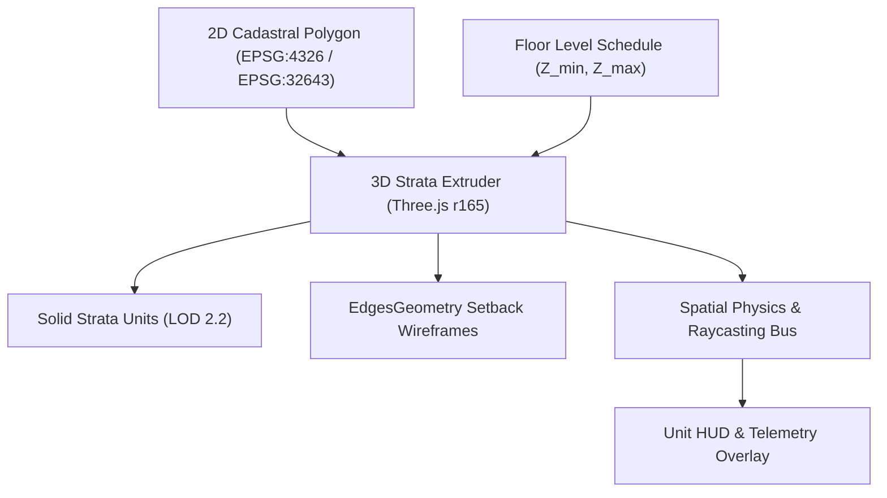

# 3D Volumetric Strata Engine & Spatial Physics

> **Canonical System Reference:** [Master Monograph Chapter 6](../docs/00-master-system-documentation.md#6-3d-volumetric-strata-engine--spatial-physics)  
> **Source Files:** [`frontend/src/components/viewer3d/ThreeCadastralViewer.tsx`](../frontend/src/components/viewer3d/ThreeCadastralViewer.tsx), [`frontend/src/lib/building3d.ts`](../frontend/src/lib/building3d.ts)  
> **Classification:** Core Geospatial Visualization Kernel

---

## 1. Engine Overview

The Bhu-Drishti 3D Volumetric Strata Engine transforms 2D legal cadastral polygons and vertical strata schedules into interactive, mathematically rigorous 3D digital twins. It implements the ISO 19152 Land Administration Domain Model (LADM) Part 3 3D Spatial Units specification.

## 2. Spatial Physics & Coordinate System
* **Up-Axis:** Z-Up GIS geocentric convention mapped to Three.js camera frames.
* **Tessellation:** `THREE.ExtrudeGeometry` with bevel disabled (`bevelEnabled: false`) to preserve exact legal boundary boundaries.
* **Selection & Raycasting:** Continuous pointer-ray intersection with bounding sphere pre-filtering for sub-millisecond unit selection.
* **Ghosting & X-Ray:** Unselected strata units fade to opacity $\alpha = 0.22$, accentuating the active unit's legal bounds.
